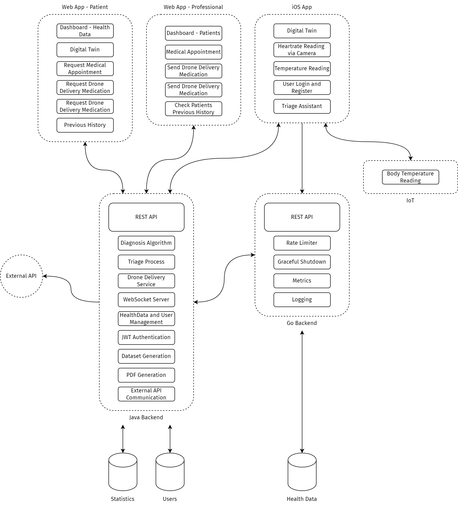

# Careline
**Transforming Healthcare with Technology**

Careline is a remote health services platform that is revolutionizing the way healthcare is delivered. We provide daily health support, expedite triage processes, and enable efficient drone delivery of prescribed medications. Our goal is to improve patient outcomes, reduce healthcare costs, and enhance overall quality of life.

**Scalable Architecture**

Designed with scalability in mind, Careline's architecture consists of two distinct backend systems:

* **GoLang**: Manages the constant influx of health data, storing it securely in a dedicated PostgreSQL database.
* **Spring Boot 3 with Java**: Handles user management, statistical health data analysis, and orchestrates the drone delivery service.

**Deployment**

All these features are deployed on a server running locally at Polytechnic of Leiria, ensuring a robust and reliable infrastructure for our platform.

## Backend Features

### GoLang

* **REST API**: Implements a RESTful API with essential features like pagination, filtering, and protection against Cross-Origin Scripting (CORS), ensuring a scalable and secure data exchange.
* **Rate Limiter**: Prevents abuse and ensures a responsive user experience by limiting excessive requests.
* **Graceful Shutdown**: Allows the server to gracefully handle shutdown requests, ensuring minimal disruption to ongoing operations.
* **Metrics**: Collects and presents server metrics to monitor performance and resource utilization.
* **Logging**: Records server activities and errors for troubleshooting and audit purposes.

### Spring Boot 3 with Java

#### Security

* **JSON Web Token (JWT) Authentication**: Secures API endpoints using JWT-based authentication, ensuring only authorized access to sensitive data.

#### Data Management

* **Dataset Generation**: Generates synthetic datasets for testing and development purposes, enabling efficient data analysis and modeling.
* **PDF Generation**: Provides functionality to generate PDF documents for medical reports and prescriptions, streamlining clinical workflows.

#### Triage and Diagnosis

* **Diagnosis Feature**: Implements diagnostic algorithms to assist in patient triage and treatment, enabling healthcare professionals to make informed decisions.
* **Triage Process**: Streamlines the triage process by automating assessment and prioritization of patient cases, reducing wait times and improving patient outcomes.

#### User Management

* **Data and User Creation**: Supports creation and management of patient and healthcare professional accounts and related data.
* **Unit Testing**: Includes comprehensive unit tests to ensure the reliability and correctness of the backend functionality.

#### Integration and Communication

* **External API Communication**: Integrates with external APIs for accessing additional medical data and services, expanding the platform's capabilities.
* **Websockets**: Enables real-time communication between clients and the server for interactive features, enhancing the user experience.

#### Drone Delivery

* **Drone Delivery**: Coordinates drone delivery of prescribed medication to patients' locations, revolutionizing the way medication is delivered.

## Internet of Things Features

### Body Temperature Monitoring

* **Measurement Integration**: Integrates IoT devices to measure patients' body temperature, enabling real-time monitoring and analysis.
* **Data Transmission**: Sends temperature data to the backend server via HTTP for processing and storage, ensuring seamless data exchange.

## Digital Twin Features

### Real-time Heart Rate Visualization

* **Real-time Heart Rate Visualization**: Provides a visual representation of patients' real-time heart rates for monitoring and analysis, enabling healthcare professionals to respond promptly to changes in patient condition.

## Augmented Reality Features

### Health Data Visualization

* **Health Data Visualization**: Uses augmented reality technology to assist patients in accurately measuring and visualizing their health data, promoting patient engagement and education.

## Mobile Application

* **Developed with SwiftUI**: The mobile application is built using SwiftUI framework for iOS development on Xcode, providing a native and intuitive user experience.
* **Key Features**: Offers functionalities such as heartbeat and temperature measurement, triage assistance, and access to help information, empowering patients to take control of their health.

## Web Platform

* **User Interface**: Provides an intuitive web interface for both patients and healthcare professionals, enabling easy access to health data and services.
* **Features**: Enables users to track health data, manage diagnoses, prescriptions, and utilize the drone delivery service, streamlining healthcare workflows and improving patient outcomes.

## Database Management

* **Database Management**: Utilizes PostgreSQL as the database server for storing and managing application data, ensuring data integrity and consistency.
* **Data Integrity**: Implements data constraints and relationships to maintain data integrity and consistency.

## Contributing

If you're interested in contributing to Careline, please submit an issue or pull request. We welcome contributions and feedback to improve the project.
